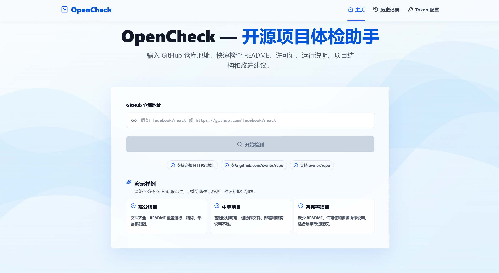
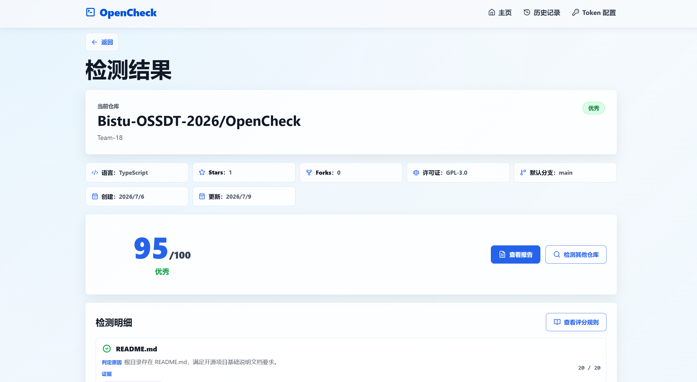
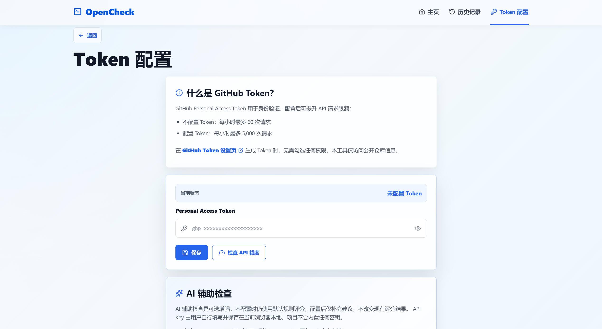
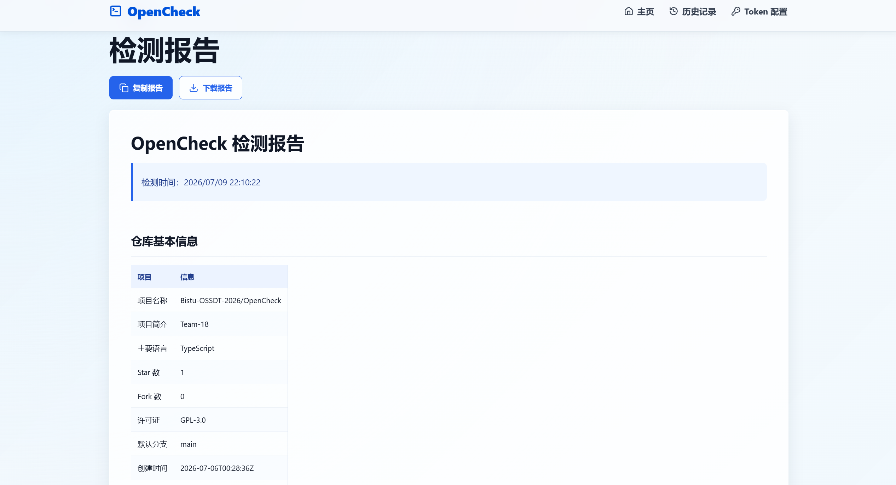
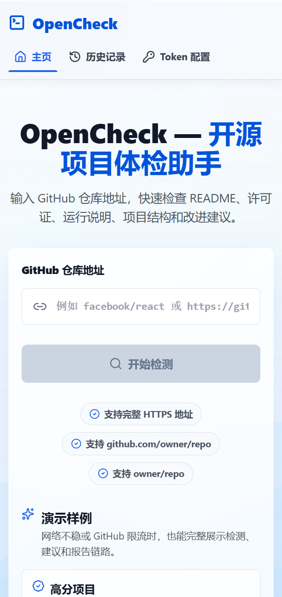

<div align="center">


# OpenCheck

### 开源项目体检助手（纯前端 MVP）

[](https://github.com/Bistu-OSSDT-2026/OpenCheck/releases)
[](LICENSE)
[](#本地运行)
[](https://react.dev)
[](https://vitejs.dev)

**OpenCheck** 是一个面向开源课程实践的小型项目体检工具。输入 GitHub 仓库地址后，它会检查 README、许可证、运行说明、项目结构、协作文件和自动化配置，并生成评分、改进建议和可复制的 Markdown 报告。

[**本地运行**](#本地运行) · [**功能特性**](#功能特性) · [**界面截图**](#界面截图) · [**贡献指南**](CONTRIBUTING.md)

</div>

## 为什么做 OpenCheck？

| | | | |
|:---:|:---:|:---:|:---:|
| 🔍 **项目体检** | 📄 **报告生成** | 🤝 **开源协作** | ✨ **可选 AI** |
| 输入 GitHub 仓库即可检查开源规范完整度。 | 自动生成评分、建议和可复制 Markdown 报告。 | 用 Issue、分支、PR、Review 留下完整协作证据。 | 用户自带兼容 API Key，AI 只补充建议，不改变默认评分。 |

<div align="center">



</div>

## 本地运行

### 前置要求

- Node.js 18 或更高版本
- npm 9 或更高版本
- Chrome、Edge、Firefox 等现代浏览器

### 安装与启动

```bash
npm ci
npm run dev
```

启动后访问终端显示的本地地址，通常是：

```text
http://127.0.0.1:5173/
```

Windows 用户也可以双击运行：

```text
start-opencheck.bat
```

该脚本会在缺少 `node_modules` 时自动执行 `npm ci`，并尽量固定使用 `http://127.0.0.1:5173/`，避免更换端口导致浏览器本地保存的 Token、AI 配置或历史记录读取不到。

### 构建检查

```bash
npm run build
```

看到构建完成且没有报错，即表示当前纯前端版本可以正常打包。

## 快速开始

1. 打开 OpenCheck 首页。
2. 输入 GitHub 公开仓库地址，例如 `Bistu-OSSDT-2026/OpenCheck`。
3. 点击 **开始检测**，查看仓库评分、检测明细和改进建议。
4. 点击 **查看报告**，复制或下载 Markdown 检测报告。
5. 如遇 GitHub API 限流，可在 **Token 配置** 页面填写自己的 GitHub Token。
6. 如需 AI 辅助建议，可在同一页面填写 OpenAI-compatible 接口配置。

## 功能特性

### GitHub 仓库体检

- 支持 `https://github.com/owner/repo`、`github.com/owner/repo`、`owner/repo` 三种输入格式。
- 读取公开仓库基础信息、根目录文件和 README 内容。
- 检查 README、LICENSE、`.gitignore`、CONTRIBUTING、CHANGELOG、依赖文件和 GitHub Actions。
- 按规则输出 0-100 分、等级标签、命中证据和扣分原因。

### README 内容分析

- 检查运行说明、技术栈、项目结构、部署/发布说明、截图/演示和使用说明。
- 对缺失或不完整内容给出可操作建议。
- 展示每项检测的判定原因，方便团队定位问题。

### 报告与历史记录

- 生成可复制、可下载的 Markdown 检测报告。
- 使用浏览器本地存储保存检测历史。
- 重复检测同一仓库时展示分数变化和检查项变化。

### GitHub Token 与 AI 辅助

- GitHub Token 用于提高 GitHub API 限流额度，不是必填项。
- AI 辅助检查默认关闭，未配置时使用默认规则评分系统。
- 支持 OpenAI-compatible 接口，可由用户自行填写 DeepSeek、豆包/火山方舟等兼容服务。
- 项目不内置、不托管、不上传任何 API Key；用户密钥只保存在当前浏览器本地。
- AI 结果只作为补充建议展示，不改变默认评分；请求失败时自动回退。

### 课程协作留痕

- 用 GitHub Issues 拆分任务。
- 每个 Issue 使用独立分支开发。
- 通过 Pull Request 提交贡献。
- PR 描述中写 `Closes #Issue编号`，合并后自动关闭 Issue。
- 由其他成员 Review、测试并提出修改意见。

## 团队协作流程

| 阶段 | 做法 |
|---|---|
| Issue | 在 GitHub Issues 中拆分任务，写清目标、范围和验收标准 |
| 分支 | 每个 Issue 使用独立分支开发，例如 `docs/issue-16-readme` |
| 修改 | 围绕 Issue 修改代码或文档，并在本地运行必要检查 |
| Pull Request | 提交 PR，并在描述中写 `Closes #Issue编号` |
| Review | 由其他成员 Review、测试并提出修改意见 |
| 合并 | Review 通过后合并 PR，对应 Issue 自动关闭 |
| 留痕 | 保留 Issue、PR、Review、提交记录和 Release 作为协作证据 |

> Issue 不要求每个人只能提交自己的。可以由负责人统一创建，再分配给成员；也可以由成员自己创建。关键是每项任务都有清晰的 Issue、分支、PR 和 Review 记录。

## 团队分工

| 角色 | 负责层 | 拥有页面 | 主要职责 |
|---|---|---|---|---|
| R1 | 数据获取层 | 无（纯函数） | URL 解析、GitHub API、Token 存储、Mock 数据 |
| R2 | 分析引擎层 | 无（纯逻辑） | 文件检测、README 启发式分析、评分、建议、报告字符串生成 |
| R3 | 脚手架 / 路由 + 共享组件 | 无（基础设施） | 项目搭建、路由常量、通用组件、结果缓存 |
| R4 | 主流程页面 + 集成点 | 首页、检测结果页 | 仓库输入、检测主流程、结果展示、错误态处理 |
| R5 | 报告 / 历史 / Token 页 + 历史存储 | 报告页、历史记录页、Token 配置页 | Markdown 报告展示、历史记录、Token 配置、localStorage 工具 |

实际开发中角色可以交叉协作，但每个共享契约应保持单一所有者：R1 负责 GitHub 数据与 Token 槽位，R2 负责 `AnalysisResult` 与报告内容，R3 负责路由、组件和结果缓存，R5 负责历史记录槽位。涉及共享字段、类型或 localStorage key 的改动，需要提前同步相关成员。

## 技术栈

| 层级 | 技术 |
|------|------|
| 前端框架 | React 18 + TypeScript |
| 构建工具 | Vite 5 |
| 路由 | React Router |
| Markdown 渲染 | React Markdown + remark-gfm |
| 图标 | lucide-react |
| 数据存储 | 浏览器 localStorage |
| 部署形态 | 纯前端静态页面 |

## 项目结构

```text
OpenCheck/
├─ public/                 # favicon 等静态资源
├─ screenshots/            # README 展示截图
├─ src/
│  ├─ api/                 # GitHub API、仓库地址解析、Token / AI 配置存储
│  ├─ components/          # 通用 UI 组件
│  ├─ engine/              # 检查规则、评分、建议、报告生成和 AI 辅助分析
│  ├─ pages/               # 首页、结果页、报告页、历史页、配置页
│  ├─ router/              # 路由常量
│  ├─ store/               # 检测结果缓存与历史记录
│  ├─ styles/              # 全局样式
│  ├─ types/               # 跨模块共享类型
│  └─ utils/               # 通用工具
├─ docs/                   # PRD、分工、接口契约和协作说明
├─ start-opencheck.bat     # Windows 本地启动脚本
└─ package.json            # 项目脚本和依赖
```

## 界面截图

**首页** — 输入仓库地址或使用演示样例开始检测


**检测结果** — 展示仓库信息、评分、检测明细和改进建议


**Token / AI 配置** — 用户可选填写 GitHub Token 和 OpenAI-compatible AI 配置


**检测报告** — 生成可复制、可下载的 Markdown 报告


**移动端首页** — 小屏幕下保持主要检测流程可用


## 当前版本范围

`v0.1.0 MVP` 是源码和静态前端版本，不是桌面软件安装包。

- 仅支持 GitHub 公开仓库。
- 不包含后端数据库、账号系统或云端同步。
- 暂不支持 GitLab、Gitee、私有仓库完整检测。
- 暂不支持批量检测多个仓库。
- 检查结果基于启发式规则，不能替代人工 Review。
- AI 辅助建议依赖用户自行配置第三方模型接口。

## 相关文档

- [产品需求文档](docs/PRD_OpenCheck.md)
- [团队分工与开发计划](docs/WORK_DIVISION.md)
- [接口契约](docs/CONTRACTS.md)
- [AI Agent 协作指南](docs/AI_AGENT_GUIDE.md)
- [贡献指南](CONTRIBUTING.md)
- [验收报告](ACCEPTANCE_REPORT.md)

## License

本项目基于 [GNU General Public License v3.0](LICENSE) 开源。

---

<div align="center">

**如果 OpenCheck 对你的开源项目体检有帮助，欢迎给项目一个 Star。**

</div>
